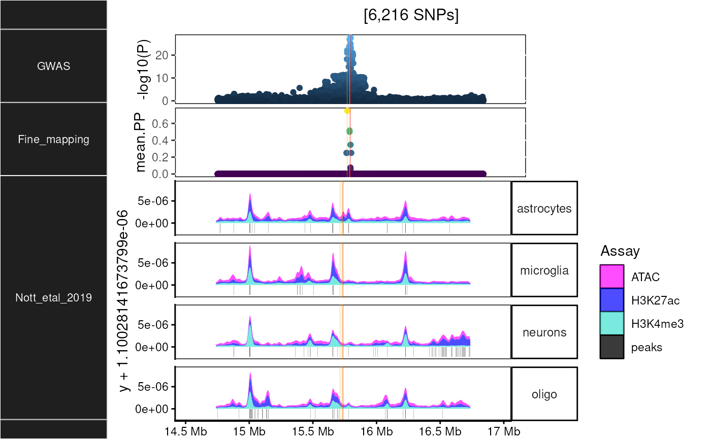

# Cell-type-specific epigenomics

``` r

library(echoannot)
```

### Nott2019

`echoannot` includes data generated by
[“Nott2019”](https://doi.org/10.1126/science.aay0793):

> Nott A, Holtman IR, Coufal NG, … Glass CK. Brain cell type-specific
> enhancer-promoter interactome maps and disease-risk association.
> Science. 2019 Nov 29;366(6469):1134-1139. doi:
> 10.1126/science.aay0793. Epub 2019 Nov 14. PMID: 31727856; PMCID:
> PMC7028213.

#### Import data

``` r

superenhancers <- echoannot::get_NOTT2019_superenhancer_interactome()
enhancers_promoters <- echoannot::NOTT2019_get_promoter_interactome_data()
peaks <- echoannot::NOTT2019_get_epigenomic_peaks()
```

    ## Importing previously downloaded files: /github/home/.cache/R/echoannot/NOTT2019_epigenomic_peaks.rds

    ## ++ NOTT2019:: 634,540 ranges retrieved.

#### Plot

``` r

dat <- echodata::BST1
histo_out <- echoannot::NOTT2019_epigenomic_histograms(dat = dat)
```

    ## NOTT2019:: Creating epigenomic histograms plot

    ## + Inferring genomic limits for window: 1x

    ## Constructing GRanges query using min/max ranges across one or more chromosomes.

    ## Downloading data from UCSC.

    ## Importing... [1] exvivo_H3K27ac_tbp

    ## Importing... [2] microglia_H3K27ac

    ## Importing... [3] neurons_H3K27ac

    ## Importing... [4] oligodendrocytes_H3K27ac

    ## Importing... [5] astrocytes_H3K27ac

    ## Importing... [6] exvivo_atac_tbp

    ## Importing... [7] microglia_atac

    ## Importing... [8] neurons_atac

    ## Importing... [9] oligodendrocytes_atac

    ## Importing... [10] astrocytes_atac

    ## Importing... [11] microglia_H3K4me3

    ## Importing... [12] neurons_H3K4me3

    ## Importing... [13] oligodendrocytes_H3K4me3

    ## Importing... [14] astrocytes_H3K4me3

    ## Importing previously downloaded files: /github/home/.cache/R/echoannot/NOTT2019_epigenomic_peaks.rds

    ## ++ NOTT2019:: 634,540 ranges retrieved.

    ## dat is already a GRanges object.

    ## 543 query SNP(s) detected with reference overlap.

    ## + Calculating max histogram height

    ## + Converting label units to Mb.

    ## using coord:genome to parse x scale
    ## using coord:genome to parse x scale

    ## Warning in !vapply(ggl, fixed, logical(1L)) & !vapply(PlotList, is, "Ideogram",
    ## : longer object length is not a multiple of shorter object length



In addition to the plot object, tables of both raw read ranges and
called peaks are included in the output list.

``` r

knitr::kable(head(histo_out$data$raw))
```

| seqnames | start | end | width | strand | score | Cell_type | Assay | Experiment |
|:---|---:|---:|---:|:---|---:|:---|:---|:---|
| chr4 | 14737349 | 14737411 | 63 | \* | 0.6 | microglia | H3K27ac | exvivo H3K27ac tbp |
| chr4 | 14737488 | 14737562 | 75 | \* | 0.2 | microglia | H3K27ac | exvivo H3K27ac tbp |
| chr4 | 14737692 | 14737766 | 75 | \* | 0.6 | microglia | H3K27ac | exvivo H3K27ac tbp |
| chr4 | 14737782 | 14737856 | 75 | \* | 0.4 | microglia | H3K27ac | exvivo H3K27ac tbp |
| chr4 | 14738054 | 14738126 | 73 | \* | 0.6 | microglia | H3K27ac | exvivo H3K27ac tbp |
| chr4 | 14738127 | 14738128 | 2 | \* | 1.2 | microglia | H3K27ac | exvivo H3K27ac tbp |

``` r

knitr::kable(head(histo_out$data$peaks))
```

| seqnames | start | end | width | strand | Assay | Marker | Cell_type | Cell_type.1 | Assay.1 | Experiment | y |
|:---|---:|---:|---:|:---|:---|:---|:---|:---|:---|:---|---:|
| 4 | 14745668 | 14746002 | 335 | \* | peaks | Olig2 | oligo | microglia | H3K27ac | exvivo H3K27ac tbp | -1.1e-06 |
| 4 | 14751439 | 14751837 | 399 | \* | peaks | Olig2 | oligo | microglia | H3K27ac | exvivo H3K27ac tbp | -1.1e-06 |
| 4 | 14768551 | 14768735 | 185 | \* | peaks | PU1 | microglia | microglia | H3K27ac | exvivo H3K27ac tbp | -1.1e-06 |
| 4 | 14768704 | 14769257 | 554 | \* | peaks | PU1 | microglia | microglia | H3K27ac | exvivo H3K27ac tbp | -1.1e-06 |
| 4 | 14771450 | 14773099 | 1650 | \* | peaks | LHX2 | astrocytes | microglia | H3K27ac | exvivo H3K27ac tbp | -1.1e-06 |
| 4 | 14829018 | 14829146 | 129 | \* | peaks | NeuN | neurons | microglia | H3K27ac | exvivo H3K27ac tbp | -1.1e-06 |

### Corces2020

`echoannot` also includes data generated by
[“Corces2019”](https://doi.org/10.1038/s41588-020-00721-x):

> Corces, M.R., Shcherbina, A., Kundu, S. et al. Single-cell epigenomic
> analyses implicate candidate causal variants at inherited risk loci
> for Alzheimer’s and Parkinson’s diseases. Nat Genet 52, 1158-1168
> (2020). <https://doi.org/10.1038/s41588-020-00721-x>

#### Import data

``` r

bulkATACseq_peaks <- echoannot::get_CORCES2020_bulkATACseq_peaks()
cicero_coaccessibility <- echoannot::get_CORCES2020_cicero_coaccessibility()
hichip_fithichip_loop_calls <- echoannot::get_CORCES2020_hichip_fithichip_loop_calls()
scATACseq_celltype_peaks <- echoannot::get_CORCES2020_scATACseq_celltype_peaks()
scATACseq_peaks <- echoannot::get_CORCES2020_scATACseq_peaks()
```

#### Plot

*Note:* This chunk is kept as `eval=FALSE` because it depends on the
`dat` variable from a prior analysis and
[`ggbio::autoplot`](https://ggplot2.tidyverse.org/reference/autoplot.html).

``` r

peak_dat <- echoannot::granges_overlap(
    dat1 = dat,
    chrom_col.1 = "CHR",
    start_col.1 = "POS",
    dat2 = scATACseq_celltype_peaks,
    chrom_col.2 = "hg38_Chromosome",
    start_col.2 = "hg38_Start",
    end_col.2 = "hg38_Stop")
ggbio::autoplot(peak_dat,
                ggplot2::aes(y=ExcitatoryNeurons, color=Effect))
```

## Session Info

``` r

utils::sessionInfo()
```

    ## R Under development (unstable) (2026-03-12 r89607)
    ## Platform: x86_64-pc-linux-gnu
    ## Running under: Ubuntu 24.04.4 LTS
    ## 
    ## Matrix products: default
    ## BLAS:   /usr/lib/x86_64-linux-gnu/openblas-pthread/libblas.so.3 
    ## LAPACK: /usr/lib/x86_64-linux-gnu/openblas-pthread/libopenblasp-r0.3.26.so;  LAPACK version 3.12.0
    ## 
    ## locale:
    ##  [1] LC_CTYPE=en_US.UTF-8       LC_NUMERIC=C              
    ##  [3] LC_TIME=en_US.UTF-8        LC_COLLATE=en_US.UTF-8    
    ##  [5] LC_MONETARY=en_US.UTF-8    LC_MESSAGES=en_US.UTF-8   
    ##  [7] LC_PAPER=en_US.UTF-8       LC_NAME=C                 
    ##  [9] LC_ADDRESS=C               LC_TELEPHONE=C            
    ## [11] LC_MEASUREMENT=en_US.UTF-8 LC_IDENTIFICATION=C       
    ## 
    ## time zone: UTC
    ## tzcode source: system (glibc)
    ## 
    ## attached base packages:
    ## [1] stats     graphics  grDevices utils     datasets  methods   base     
    ## 
    ## other attached packages:
    ## [1] echoannot_1.0.1  BiocStyle_2.39.0
    ## 
    ## loaded via a namespace (and not attached):
    ##   [1] aws.s3_0.3.22               BiocIO_1.21.0              
    ##   [3] bitops_1.0-9                filelock_1.0.3             
    ##   [5] tibble_3.3.1                R.oo_1.27.1                
    ##   [7] cellranger_1.1.0            basilisk.utils_1.23.1      
    ##   [9] graph_1.89.1                XML_3.99-0.22              
    ##  [11] rpart_4.1.24                lifecycle_1.0.5            
    ##  [13] OrganismDbi_1.53.2          ensembldb_2.35.0           
    ##  [15] lattice_0.22-9              MASS_7.3-65                
    ##  [17] backports_1.5.0             magrittr_2.0.4             
    ##  [19] openxlsx_4.2.8.1            Hmisc_5.2-5                
    ##  [21] sass_0.4.10                 rmarkdown_2.30             
    ##  [23] jquerylib_0.1.4             yaml_2.3.12                
    ##  [25] otel_0.2.0                  zip_2.3.3                  
    ##  [27] reticulate_1.45.0           ggbio_1.59.0               
    ##  [29] gld_2.6.8                   DBI_1.3.0                  
    ##  [31] RColorBrewer_1.1-3          abind_1.4-8                
    ##  [33] expm_1.0-0                  GenomicRanges_1.63.1       
    ##  [35] purrr_1.2.1                 R.utils_2.13.0             
    ##  [37] AnnotationFilter_1.35.0     biovizBase_1.59.0          
    ##  [39] BiocGenerics_0.57.0         RCurl_1.98-1.17            
    ##  [41] nnet_7.3-20                 VariantAnnotation_1.57.1   
    ##  [43] IRanges_2.45.0              S4Vectors_0.49.0           
    ##  [45] pkgdown_2.2.0               echodata_1.0.0             
    ##  [47] piggyback_0.1.5             codetools_0.2-20           
    ##  [49] DelayedArray_0.37.0         DT_0.34.0                  
    ##  [51] xml2_1.5.2                  tidyselect_1.2.1           
    ##  [53] UCSC.utils_1.7.1            farver_2.1.2               
    ##  [55] matrixStats_1.5.0           stats4_4.6.0               
    ##  [57] base64enc_0.1-6             Seqinfo_1.1.0              
    ##  [59] echotabix_1.0.1             GenomicAlignments_1.47.0   
    ##  [61] jsonlite_2.0.0              e1071_1.7-17               
    ##  [63] Formula_1.2-5               systemfonts_1.3.2          
    ##  [65] tools_4.6.0                 ragg_1.5.1                 
    ##  [67] DescTools_0.99.60           Rcpp_1.1.1                 
    ##  [69] glue_1.8.0                  gridExtra_2.3              
    ##  [71] SparseArray_1.11.11         xfun_0.56                  
    ##  [73] MatrixGenerics_1.23.0       GenomeInfoDb_1.47.2        
    ##  [75] dplyr_1.2.0                 withr_3.0.2                
    ##  [77] BiocManager_1.30.27         fastmap_1.2.0              
    ##  [79] basilisk_1.23.0             boot_1.3-32                
    ##  [81] digest_0.6.39               R6_2.6.1                   
    ##  [83] textshaping_1.0.5           colorspace_2.1-2           
    ##  [85] dichromat_2.0-0.1           RSQLite_2.4.6              
    ##  [87] cigarillo_1.1.0             R.methodsS3_1.8.2          
    ##  [89] tidyr_1.3.2                 generics_0.1.4             
    ##  [91] data.table_1.18.2.1         rtracklayer_1.71.3         
    ##  [93] class_7.3-23                httr_1.4.8                 
    ##  [95] htmlwidgets_1.6.4           S4Arrays_1.11.1            
    ##  [97] pkgconfig_2.0.3             gtable_0.3.6               
    ##  [99] Exact_3.3                   blob_1.3.0                 
    ## [101] S7_0.2.1                    XVector_0.51.0             
    ## [103] echoconda_1.0.0             htmltools_0.5.9            
    ## [105] bookdown_0.46               RBGL_1.87.0                
    ## [107] ProtGenerics_1.43.0         scales_1.4.0               
    ## [109] Biobase_2.71.0              lmom_3.2                   
    ## [111] png_0.1-8                   knitr_1.51                 
    ## [113] rstudioapi_0.18.0           tzdb_0.5.0                 
    ## [115] reshape2_1.4.5              rjson_0.2.23               
    ## [117] checkmate_2.3.4             curl_7.0.0                 
    ## [119] proxy_0.4-29                cachem_1.1.0               
    ## [121] stringr_1.6.0               rootSolve_1.8.2.4          
    ## [123] parallel_4.6.0              foreign_0.8-91             
    ## [125] AnnotationDbi_1.73.0        restfulr_0.0.16            
    ## [127] desc_1.4.3                  pillar_1.11.1              
    ## [129] grid_4.6.0                  vctrs_0.7.1                
    ## [131] cluster_2.1.8.2             htmlTable_2.4.3            
    ## [133] evaluate_1.0.5              readr_2.2.0                
    ## [135] GenomicFeatures_1.63.1      mvtnorm_1.3-5              
    ## [137] cli_3.6.5                   compiler_4.6.0             
    ## [139] Rsamtools_2.27.1            rlang_1.1.7                
    ## [141] crayon_1.5.3                labeling_0.4.3             
    ## [143] aws.signature_0.6.0         plyr_1.8.9                 
    ## [145] forcats_1.0.1               fs_1.6.7                   
    ## [147] stringi_1.8.7               viridisLite_0.4.3          
    ## [149] BiocParallel_1.45.0         Biostrings_2.79.5          
    ## [151] lazyeval_0.2.2              Matrix_1.7-4               
    ## [153] downloadR_1.0.0             dir.expiry_1.19.0          
    ## [155] BSgenome_1.79.1             patchwork_1.3.2            
    ## [157] hms_1.1.4                   bit64_4.6.0-1              
    ## [159] ggplot2_4.0.2               KEGGREST_1.51.1            
    ## [161] SummarizedExperiment_1.41.1 haven_2.5.5                
    ## [163] memoise_2.0.1               bslib_0.10.0               
    ## [165] bit_4.6.0                   readxl_1.4.5
