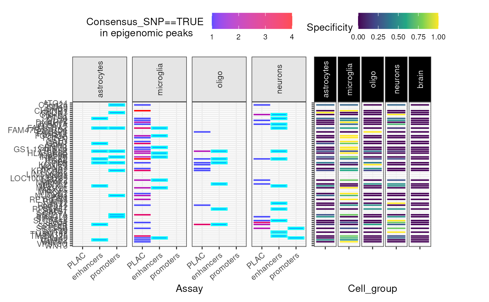
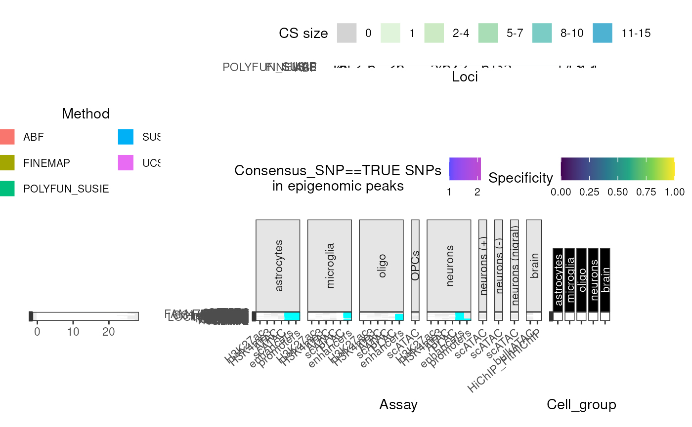

# Getting Started

``` r

library(echoannot)
has_internet <- tryCatch(
    !is.null(curl::nslookup("github.com", error = FALSE)),
    error = function(e) FALSE
)
```

## Import data

To get the full dataset of all fine-mapped Parkinson’s Disease loci, you
can use the following function:

``` r

merged_DT <- echodata::get_Nalls2019_merged()
```

## Annotate

Annotate SNP-wise fine-mapping results.

Here, we’re only annotating a small number of SNPs high-confidence
causal SNPs for demo purposes. The more SNPs you supply to
`annotate_snps`, the longer it will take to query the selected databases
for each SNP.

*Note:* This chunk is kept as `eval=FALSE` because `annotate_snps`
queries external databases (HaploReg, RegulomeDB, BioMart), which can be
slow and may have rate limits.

``` r

#### Only query high-confidence fine-mapping SNPs from one locus ####
dat <- merged_DT[Locus=="LRRK2" & Consensus_SNP==TRUE,]
#### Query annotations ####
dat_annot <- echoannot::annotate_snps(dat = dat,
                                      haploreg_annotation = TRUE,
                                      regulomeDB_annotation = TRUE,
                                      biomart_annotation = TRUE)
knitr::kable(dat_annot)
```

## Summary plots

### Credible Set bin plot

``` r

gg_cs_bin <- echoannot::CS_bin_plot(merged_DT = merged_DT,
                                    show_plot = FALSE)
```

### Credible Set counts plot

``` r

gg_cs_counts <- echoannot::CS_counts_plot(merged_DT = merged_DT,
                                          show_plot = FALSE)
```

    ## Warning in ggplot2::geom_bar(stat = "identity", color = "white", size = 0.05): Ignoring unknown parameters: `size`
    ## Ignoring unknown parameters: `size`

### Epigenomic data

``` r

gg_epi <- echoannot::peak_overlap_plot(
    merged_DT = merged_DT,
    include.NOTT2019_enhancers_promoters = TRUE,
    include.NOTT2019_PLACseq = TRUE,
    #### Omit many annotations to save time ####
    include.NOTT2019_peaks = FALSE,
    include.CORCES2020_scATACpeaks = FALSE,
    include.CORCES2020_Cicero_coaccess = FALSE,
    include.CORCES2020_bulkATACpeaks = FALSE,
    include.CORCES2020_HiChIP_FitHiChIP_coaccess = FALSE,
    include.CORCES2020_gene_annotations = FALSE)
```

    ## ++ NOTT2019:: Getting regulatory regions data.

    ## Importing Astrocyte enhancers ...

    ## Importing Astrocyte promoters ...

    ## Importing Neuronal enhancers ...

    ## Importing Neuronal promoters ...

    ## Importing Oligo enhancers ...

    ## Importing Oligo promoters ...

    ## Importing Microglia enhancers ...

    ## Importing Microglia promoters ...

    ## Converting dat to GRanges object.
    ## Converting dat to GRanges object.

    ## 48 query SNP(s) detected with reference overlap.

    ## ++ NOTT2019:: Getting interaction anchors data.

    ## Importing Microglia interactome ...

    ## Importing Neuronal interactome ...

    ## Importing Oligo interactome ...

    ## Converting dat to GRanges object.

    ## 52 query SNP(s) detected with reference overlap.

    ## Converting dat to GRanges object.

    ## 44 query SNP(s) detected with reference overlap.

    ## Warning: Using `size` aesthetic for lines was deprecated in ggplot2 3.4.0.
    ## ℹ Please use `linewidth` instead.
    ## ℹ The deprecated feature was likely used in the echoannot package.
    ##   Please report the issue at <https://github.com/RajLabMSSM/echoannot/issues>.
    ## This warning is displayed once per session.
    ## Call `lifecycle::last_lifecycle_warnings()` to see where this warning was
    ## generated.

    ## Warning: The `size` argument of `element_line()` is deprecated as of ggplot2 3.4.0.
    ## ℹ Please use the `linewidth` argument instead.
    ## ℹ The deprecated feature was likely used in the echoannot package.
    ##   Please report the issue at <https://github.com/RajLabMSSM/echoannot/issues>.
    ## This warning is displayed once per session.
    ## Call `lifecycle::last_lifecycle_warnings()` to see where this warning was
    ## generated.

    ## Warning: `aes_string()` was deprecated in ggplot2 3.0.0.
    ## ℹ Please use tidy evaluation idioms with `aes()`.
    ## ℹ See also `vignette("ggplot2-in-packages")` for more information.
    ## ℹ The deprecated feature was likely used in the echoannot package.
    ##   Please report the issue at <https://github.com/RajLabMSSM/echoannot/issues>.
    ## This warning is displayed once per session.
    ## Call `lifecycle::last_lifecycle_warnings()` to see where this warning was
    ## generated.



### Super summary plot

Creates one big merged plot using the subfunctions above.

``` r

super_plot <- echoannot::super_summary_plot(merged_DT = merged_DT,
                                            plot_missense = FALSE)
```

    ## Warning in ggplot2::geom_bar(stat = "identity", color = "white", size = 0.05): Ignoring unknown parameters: `size`
    ## Ignoring unknown parameters: `size`

    ## Importing previously downloaded files: /github/home/.cache/R/echoannot/NOTT2019_epigenomic_peaks.rds

    ## ++ NOTT2019:: 634,540 ranges retrieved.

    ## Converting dat to GRanges object.

    ## 113 query SNP(s) detected with reference overlap.

    ## ++ NOTT2019:: Getting regulatory regions data.

    ## Importing Astrocyte enhancers ...

    ## Importing Astrocyte promoters ...

    ## Importing Neuronal enhancers ...

    ## Importing Neuronal promoters ...

    ## Importing Oligo enhancers ...

    ## Importing Oligo promoters ...

    ## Importing Microglia enhancers ...

    ## Importing Microglia promoters ...

    ## Converting dat to GRanges object.
    ## Converting dat to GRanges object.

    ## 48 query SNP(s) detected with reference overlap.

    ## ++ NOTT2019:: Getting interaction anchors data.

    ## Importing Microglia interactome ...

    ## Importing Neuronal interactome ...

    ## Importing Oligo interactome ...

    ## Converting dat to GRanges object.

    ## 52 query SNP(s) detected with reference overlap.

    ## Converting dat to GRanges object.

    ## 44 query SNP(s) detected with reference overlap.

    ## CORCES2020:: Extracting overlapping cell-type-specific scATAC-seq peaks

    ## Converting dat to GRanges object.

    ## 13 query SNP(s) detected with reference overlap.

    ## CORCES2020:: Annotating peaks by cell-type-specific target genes

    ## CORCES2020:: Extracting overlapping bulkATAC-seq peaks from brain tissue

    ## Converting dat to GRanges object.

    ## 4 query SNP(s) detected with reference overlap.

    ## CORCES2020:: Annotating peaks by bulk brain target genes

    ## Converting dat to GRanges object.

    ## 70 query SNP(s) detected with reference overlap.

    ## Converting dat to GRanges object.

    ## 72 query SNP(s) detected with reference overlap.

    ## + CORCES2020:: Found 142 hits with HiChIP_FitHiChIP coaccessibility loop anchors.

    ## Warning: The dot-dot notation (`..count..`) was deprecated in ggplot2 3.4.0.
    ## ℹ Please use `after_stat(count)` instead.
    ## ℹ The deprecated feature was likely used in the echoannot package.
    ##   Please report the issue at <https://github.com/RajLabMSSM/echoannot/issues>.
    ## This warning is displayed once per session.
    ## Call `lifecycle::last_lifecycle_warnings()` to see where this warning was
    ## generated.

    ## Warning: Removed 83 rows containing missing values or values outside the scale range
    ## (`geom_bar()`).



## Session Info

``` r

utils::sessionInfo()
```

    ## R Under development (unstable) (2026-03-12 r89607)
    ## Platform: x86_64-pc-linux-gnu
    ## Running under: Ubuntu 24.04.4 LTS
    ## 
    ## Matrix products: default
    ## BLAS:   /usr/lib/x86_64-linux-gnu/openblas-pthread/libblas.so.3 
    ## LAPACK: /usr/lib/x86_64-linux-gnu/openblas-pthread/libopenblasp-r0.3.26.so;  LAPACK version 3.12.0
    ## 
    ## locale:
    ##  [1] LC_CTYPE=en_US.UTF-8       LC_NUMERIC=C              
    ##  [3] LC_TIME=en_US.UTF-8        LC_COLLATE=en_US.UTF-8    
    ##  [5] LC_MONETARY=en_US.UTF-8    LC_MESSAGES=en_US.UTF-8   
    ##  [7] LC_PAPER=en_US.UTF-8       LC_NAME=C                 
    ##  [9] LC_ADDRESS=C               LC_TELEPHONE=C            
    ## [11] LC_MEASUREMENT=en_US.UTF-8 LC_IDENTIFICATION=C       
    ## 
    ## time zone: UTC
    ## tzcode source: system (glibc)
    ## 
    ## attached base packages:
    ## [1] stats     graphics  grDevices utils     datasets  methods   base     
    ## 
    ## other attached packages:
    ## [1] echoannot_1.0.1  BiocStyle_2.39.0
    ## 
    ## loaded via a namespace (and not attached):
    ##   [1] aws.s3_0.3.22               BiocIO_1.21.0              
    ##   [3] bitops_1.0-9                filelock_1.0.3             
    ##   [5] tibble_3.3.1                R.oo_1.27.1                
    ##   [7] cellranger_1.1.0            basilisk.utils_1.23.1      
    ##   [9] graph_1.89.1                XML_3.99-0.22              
    ##  [11] rpart_4.1.24                lifecycle_1.0.5            
    ##  [13] OrganismDbi_1.53.2          ensembldb_2.35.0           
    ##  [15] lattice_0.22-9              MASS_7.3-65                
    ##  [17] backports_1.5.0             magrittr_2.0.4             
    ##  [19] openxlsx_4.2.8.1            Hmisc_5.2-5                
    ##  [21] sass_0.4.10                 rmarkdown_2.30             
    ##  [23] jquerylib_0.1.4             yaml_2.3.12                
    ##  [25] otel_0.2.0                  zip_2.3.3                  
    ##  [27] reticulate_1.45.0           ggbio_1.59.0               
    ##  [29] gld_2.6.8                   DBI_1.3.0                  
    ##  [31] RColorBrewer_1.1-3          abind_1.4-8                
    ##  [33] expm_1.0-0                  GenomicRanges_1.63.1       
    ##  [35] purrr_1.2.1                 R.utils_2.13.0             
    ##  [37] AnnotationFilter_1.35.0     biovizBase_1.59.0          
    ##  [39] BiocGenerics_0.57.0         RCurl_1.98-1.17            
    ##  [41] nnet_7.3-20                 VariantAnnotation_1.57.1   
    ##  [43] IRanges_2.45.0              S4Vectors_0.49.0           
    ##  [45] pkgdown_2.2.0               echodata_1.0.0             
    ##  [47] piggyback_0.1.5             codetools_0.2-20           
    ##  [49] DelayedArray_0.37.0         DT_0.34.0                  
    ##  [51] xml2_1.5.2                  tidyselect_1.2.1           
    ##  [53] UCSC.utils_1.7.1            farver_2.1.2               
    ##  [55] matrixStats_1.5.0           stats4_4.6.0               
    ##  [57] base64enc_0.1-6             Seqinfo_1.1.0              
    ##  [59] echotabix_1.0.1             GenomicAlignments_1.47.0   
    ##  [61] jsonlite_2.0.0              e1071_1.7-17               
    ##  [63] Formula_1.2-5               systemfonts_1.3.2          
    ##  [65] tools_4.6.0                 ragg_1.5.1                 
    ##  [67] DescTools_0.99.60           Rcpp_1.1.1                 
    ##  [69] glue_1.8.0                  gridExtra_2.3              
    ##  [71] SparseArray_1.11.11         xfun_0.56                  
    ##  [73] MatrixGenerics_1.23.0       GenomeInfoDb_1.47.2        
    ##  [75] dplyr_1.2.0                 withr_3.0.2                
    ##  [77] BiocManager_1.30.27         fastmap_1.2.0              
    ##  [79] basilisk_1.23.0             boot_1.3-32                
    ##  [81] digest_0.6.39               R6_2.6.1                   
    ##  [83] textshaping_1.0.5           colorspace_2.1-2           
    ##  [85] dichromat_2.0-0.1           RSQLite_2.4.6              
    ##  [87] cigarillo_1.1.0             R.methodsS3_1.8.2          
    ##  [89] tidyr_1.3.2                 generics_0.1.4             
    ##  [91] data.table_1.18.2.1         rtracklayer_1.71.3         
    ##  [93] class_7.3-23                httr_1.4.8                 
    ##  [95] htmlwidgets_1.6.4           S4Arrays_1.11.1            
    ##  [97] pkgconfig_2.0.3             gtable_0.3.6               
    ##  [99] Exact_3.3                   blob_1.3.0                 
    ## [101] S7_0.2.1                    XVector_0.51.0             
    ## [103] echoconda_1.0.0             htmltools_0.5.9            
    ## [105] bookdown_0.46               RBGL_1.87.0                
    ## [107] ProtGenerics_1.43.0         scales_1.4.0               
    ## [109] Biobase_2.71.0              lmom_3.2                   
    ## [111] png_0.1-9                   knitr_1.51                 
    ## [113] rstudioapi_0.18.0           tzdb_0.5.0                 
    ## [115] reshape2_1.4.5              rjson_0.2.23               
    ## [117] checkmate_2.3.4             curl_7.0.0                 
    ## [119] proxy_0.4-29                cachem_1.1.0               
    ## [121] stringr_1.6.0               rootSolve_1.8.2.4          
    ## [123] parallel_4.6.0              foreign_0.8-91             
    ## [125] AnnotationDbi_1.73.0        restfulr_0.0.16            
    ## [127] desc_1.4.3                  pillar_1.11.1              
    ## [129] grid_4.6.0                  vctrs_0.7.1                
    ## [131] cluster_2.1.8.2             htmlTable_2.4.3            
    ## [133] evaluate_1.0.5              readr_2.2.0                
    ## [135] GenomicFeatures_1.63.1      mvtnorm_1.3-6              
    ## [137] cli_3.6.5                   compiler_4.6.0             
    ## [139] Rsamtools_2.27.1            rlang_1.1.7                
    ## [141] crayon_1.5.3                labeling_0.4.3             
    ## [143] aws.signature_0.6.0         plyr_1.8.9                 
    ## [145] forcats_1.0.1               fs_1.6.7                   
    ## [147] stringi_1.8.7               viridisLite_0.4.3          
    ## [149] BiocParallel_1.45.0         Biostrings_2.79.5          
    ## [151] lazyeval_0.2.2              Matrix_1.7-4               
    ## [153] downloadR_1.0.0             dir.expiry_1.19.0          
    ## [155] BSgenome_1.79.1             patchwork_1.3.2            
    ## [157] hms_1.1.4                   bit64_4.6.0-1              
    ## [159] ggplot2_4.0.2               KEGGREST_1.51.1            
    ## [161] SummarizedExperiment_1.41.1 haven_2.5.5                
    ## [163] memoise_2.0.1               bslib_0.10.0               
    ## [165] bit_4.6.0                   readxl_1.4.5
